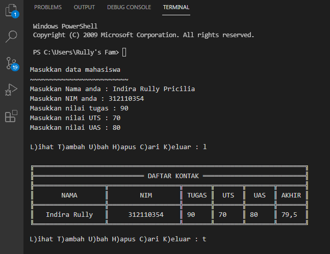

# Praktikum5

## Tugas Pertemuan 10 - Praktikum 5 (Bahasa Pemrograman)

= Nama : Indira Rully Pricilia

= NIM : 312110354

= Kelas : TI.21.CA.1

===============================

Pada Pertemuan 10 kali ini saya mendapatkan materi *List, Tuple dan Dictionary*.
Nah, untuk praktikum 5 ini materi yang didapatkan adalah **List**.

Didalam materi praktikum 5 ini terdapat 2 tugas. Yaitu : **Latihan dan Praktikum**.

### Latihan
Berikut adalah tugas dari Latihan, bisa dilihat pada gambar dibawah ini :


Berikut source code / program sederhana yang telah saya buat :
```ruby
#dictionary
#indirarully
daftarKontak = {"Nama":"Nomer Telpon"}
kontak       = {'Ari':'081267888', 'Dina' : '087677776'}

#print
print(30*"═")
print("    Nama    |  Nomor Telepon  ") #prinr daftarkontak
print(30*"-")
print("   # Ari    | ", kontak['Ari']) #print kontak Ari
print("   # Dina   | ", kontak['Dina']) #print kontak Dina
print(30*"═")

#Tampilkan kontaknya Ari
print("Tampilkan kontaknya Ari")
print("    Ari     | ", kontak['Ari']) #print kontak Ari
print(30*"═")
#Tambah kontak baru dengan nama Riko, nomor 087654544
print("Tambah kontak baru dengan nama Riko, nomor 087654544")
kontak['Riko'] = '087654544'
print("    Riko    | ", kontak['Riko'])
print(30*"═")

#Ubah kontak Dina dengan nomor baru 088999776
print("Ubah kontak Dina dengan nomor baru 088999776")
kontak['Dina'] = '088999776'
print("    Dina    | ", kontak['Dina'])
print(30*"═")

#Tampilkan semua Nama
print("Tampilkan semua Nama")
print(kontak.keys())
print(30*"═")

#Tampilkan semua Nomor
print("Tampilkan semua Nomor")
print(kontak.values())
print(30*"═")

#Tampilkan daftar Nama dan nomornya
print("Tampilkan daftar Nama dan nomornya")
print(kontak.items())
print(30*"═")

#Menghapus kontak Dina
print("Hapus kontak Dina")
kontak.pop('Dina')
print(kontak.items())
print(30*"═")
```

Untuk hasil dari source code tersebut adalah seperti berikut :


### Praktikum
Untuk tugas yang kedua yaitu Tugas Praktikum, yaitu tugas untuk membuat program sederhana menampilkan Data Nilai Mahasiswa.

Berikut soal yang diberikan oleh dosen :


Dan ini output yang diinginkan dosen :


Berikut source code yang telah saya buat :
```ruby
# -- encoding: utf-8 --
#indirarully

P = print
print("Masukan data mahasiswa")
print("~~~~~~~~~~~~~~~~~~~~~~")
nama = input("Masukan Nama Anda :")
nim = int(input("Masukan NIM Anda :"))
nilai_tugas = int(input("Masukan nilai tugas :"))
nilai_uts = int(input("Masukan nilai uts :"))
nilai_uas = int(input("Masukan nilai uas :"))
while True:
    P("")
    P("")
    c = input("L)ihat, T)ambah, U)bah, H)apus, C)ari, K)eluar: ")
    if c.lower() == 'q':
        break
    elif c.lower() == 'l':
        i = open('database.txt','r').read().splitlines()
        P(" ╔═════════════════════════════════════════════════════════════════════╗")
        P(" ╠════════════════════════════ DAFTAR KONTAK ══════════════════════════╣")
        P(" ╠══════════════════╦══════════════════╦═══════╦═══════╦═══════╦═══════╣")
        P(" ║      NAMA        ║       NIM        ║ TUGAS ║  UTS  ║  UAS  ║ AKHIR ║")
        P(" ╠══════════════════╬══════════════════╬═══════╬═══════╬═══════╬═══════╣")
        for l in i:
            if l == '':
                pass
            else:
                l1 = l.replace('Nama : ','').replace('Nim : ','').replace('Tugas : ','').replace('UTS : ','').replace('UAS : ','').replace('Akhir : ','')
                na,ni,tu,uts,uas,akhir = l1.strip().split('|')
                P((' ║ ')+(na[:15]).ljust(17,'.')+('║ ')+(ni).ljust(17)+('║ ')+(tu).ljust(6)+('║ ')+(uts).ljust(6)+('║ ')+(uas).ljust(6)+('║ ')+(akhir).ljust(6)+('║'))
        P(" ╚══════════════════╩══════════════════╩═══════╩═══════╩═══════╩═══════╝")
    elif c.lower() == 'c':
        cari = input(' Mencari : ')
        i = open('database.txt','r').read().splitlines()
        P(" ╔═════════════════════════════════════════════════════════════════════╗")
        P(" ╠════════════════════════════ DAFTAR KONTAK ══════════════════════════╣")
        P(" ╠══════════════════╦══════════════════╦═══════╦═══════╦═══════╦═══════╣")
        P(" ║      NAMA        ║       NIM        ║ TUGAS ║  UTS  ║  UAS  ║ AKHIR ║")
        P(" ╠══════════════════╬══════════════════╬═══════╬═══════╬═══════╬═══════╣")
        for l in i:
            if l == '':
                pass
            elif cari in l:
                l1 = l.replace('Nama : ','').replace('Nim : ','').replace('Tugas : ','').replace('UTS : ','').replace('UAS : ','').replace('Akhir : ','')
                na,ni,tu,uts,uas,akhir = l1.strip().split('|')
                P((' ║ ')+(na).ljust(17)+('║ ')+(ni).ljust(17)+('║ ')+(tu).ljust(6)+('║ ')+(uts).ljust(6)+('║ ')+(uas).ljust(6)+('║ ')+(akhir).ljust(6)+('║'))
        P(" ╚══════════════════╩══════════════════╩═══════╩═══════╩═══════╩═══════╝")
    elif c.lower() == 'h':
        u = open('database.txt','r').read().splitlines()
        target = input(' Masukan Nama : ')
        nm = []
        for l in u:
            if l == '':
                pass
            else:
                l1 = l.replace('Nama : ','').replace('Nim : ','').replace('Tugas : ','').replace('UTS : ','').replace('UAS : ','').replace('Akhir : ','')
                na,ni,tu,uts,uas,akhir = l1.strip().split('|')
                if str(na) == str(target):
                    P('BERHASIL MENGHAPUS Data %s'%(target))
                    pass
                else:
                    nm.append(str(l)+'\n')
        new = open('database.txt','w')
        new.write(str(nm))
        new.close()
        new = open('database.txt','r').read().splitlines()
        new1 = open('database.txt','w')
        new1.close()
        new2 = open('database.txt','a')
        for i in new:
            i2 = i.replace("['","").replace("\\n', '", "\n").replace("']","").replace("\\n",'')
            new2.write(i2)
        new2.close()
    elif c.lower() == 'u':
        u = open('database.txt','r').read().splitlines()
        target = input(' Masukan Nama : ')
        nm = []
        for l in u:
            if l == '':
                pass
            else:
                l1 = l.replace('Nama : ','').replace('Nim : ','').replace('Tugas : ','').replace('UTS : ','').replace('UAS : ','').replace('Akhir : ','')
                na,ni,tu,uts,uas,akhir = l1.strip().split('|')
                if na == target:
                    P(' Mengedit Data %s'%(target))
                    while (True):
                        nama = input(" Nama : ")
                        if nama == '':
                            P(' Masukan dengan Nama Dengan Benar')
                        else:
                            break
                    while (True):
                        try:
                            nim  = int(input(" NIM  : "))
                            if nim == '':
                                P(' Masukan Nim dengan Angka')
                        except ValueError:
                            P(' Masukan Nim dengan Angka')
                        else:
                            break
                    while (True):
                        try:
                            tugas  = int(input(" TUGAS  : "))
                            if tugas == '':
                                P(' Masukan TUGAS dengan Angka')
                        except ValueError:
                            P(' Masukan TUGAS dengan Angka')
                        else:
                            break
                    while (True):
                        try:
                            uts  = int(input(" UTS  : "))
                            if uts == '':
                                P(' Masukan UTS dengan Angka')
                        except ValueError:
                            P(' Masukan UTS dengan Angka')
                        else:
                            break
                    while (True):
                        try:
                            uas  = int(input(" UAS  : "))
                            if uas == '':
                                P(' Masukan UAS dengan Angka')
                        except ValueError:
                            P(' Masukan UAS dengan Angka')
                        else:
                            break
                    akhir = round((float(tugas) * 0.3)+(float(uts) * 0.35)+(float(uas) * 0.35),2)
                    edit  =('Nama : '+nama+'|Nim : '+str(nim)+'|Tugas : '+str(tugas)+'|UTS : '+str(uts)+'|UAS : '+str(uas)+"|Akhir : "+str(akhir)+'\n')
                    nm.append(edit+'\n')
                else:
                    nm.append(str(l)+'\n')
        new = open('database.txt','w')
        new.write(str(nm))
        new.close()
        new = open('database.txt','r').read().splitlines()
        new1 = open('database.txt','w')
        new1.close()
        new2 = open('database.txt','a')
        for i in new:
            i2 = i.replace("['","").replace("\\n', '", "\n").replace("']","").replace("\\n","\n")
            new2.write(i2+'\n')
        new2.close()
    elif c.lower() == 't':
        i = open('database.txt','a')
        P(" Tambah Kontak")
        while (True):
            nama = input(" Nama : ")
            if nama == '':
                P(' Masukan dengan Nama Dengan Benar')
            else:
                break
        while (True):
            try:
                nim  = int(input(" NIM  : "))
                if nim == '':
                    P(' Masukan Nim dengan Angka')
            except ValueError:
                P(' Masukan Nim dengan Angka')
            else:
                break
        while (True):
            try:
                tugas  = int(input(" TUGAS  : "))
                if tugas == '':
                    P(' Masukan TUGAS dengan Angka')
            except ValueError:
                P(' Masukan TUGAS dengan Angka')
            else:
                break
        while (True):
            try:
                uts  = int(input(" UTS  : "))
                if uts == '':
                    P(' Masukan UTS dengan Angka')
            except ValueError:
                P(' Masukan UTS dengan Angka')
            else:
                break
        while (True):
            try:
                uas  = int(input(" UAS  : "))
                if uas == '':
                    P(' Masukan UAS dengan Angka')
            except ValueError:
                P(' Masukan UAS dengan Angka')
            else:
                break
        akhir = round((float(tugas) * 0.3)+(float(uts) * 0.35)+(float(uas) * 0.35),2)
        i.write('\nNama : '+nama+'|Nim : '+str(nim)+'|Tugas : '+str(tugas)+'|UTS : '+str(uts)+'|UAS : '+str(uas)+"|Akhir : "+str(akhir)+'\n')
        i.close()
    else:
        P("Silahkan pilih menu yang tersedia...")
```
Cukup banyak baris yang saya buat untuk program tersebut. Dan saya akan menjelaskan sedikit pengertian dari fitur-fitur yang ada di program tersebut.

**1. Penggunaan if c.lower()**

if c.lower() fungsinya apabila user menginputkan denga huruf besar, maka otomatis akan menjadi huruf kecil sehingga kondisi yang digunakan tercapai. Contoh :

• if c.lower() == q


**2. Penggunaan while True**

while True berfungsi untuk mendeteksi jika format yang diinputkan bukan berupa type maka akan muncul error


**3. Penggunaan else**

Fungsi else jika tidak error dan type yang dimasukan sesuai maka proses while True


**4. Penggunaan valueError**

Fungsinya apabila diinputkan bukan berupa type maka hasil nya error (valueError)


**5. Fitur Tambah Data**

• Fitur ini akan muncul ketika mengetikan perintah T

• Pada fitur tersebut user akan diminta memasukkan data berupa : NIM, Nama, Nilai Tugas, Nilai UTS dan Nilai UAS

• Untuk nilai akhir akan muncul otomatis, karena telah diatur oleh system


**6. Fitur Lihat Data**

• Fitur ini akan muncul ketika user mengetikkan perintah L

• Dalam fitur ini terdapat 2 output, jika data Kosong atau tidak ada. Sedangkan output berikutnya akan menampilkan data dalam bentuk table


**7. Fitur Ubah Data**

• Fitur ini akan muncul ketika user mengetikan perintah U

• User akan diminta untuk memasukkan NIM, fitur ini akan mengubah berdasarkan NIM

• Setelah user mamasukkan NIM yang akan diubah, maka sistem akan menampilkan pertanyaan berupa Data apa yang akan diubah


**8. Fitur Pencarian Data**

• Fitur ini akan muncul ketika user mengetikan perintah C

• Untuk menampilkan data lain, saya akan menambahkan data baru

• Ketika data baru sudah diinputkan, maka fitur cari siap digunakan. Seperti fitur-fitur lainnya, program ini menggunakan data primary key NIM.


**9. Fitur Hapus Data**

Fitur ini akan muncul ketika user mengetikkan perintah H


**10. Fitur Keluar dari pendataan**

Fitur ini akan muncul ketika user mengetikkan perintah K


Berikut hasil output dari praktikum nya :



Dan berikut flowchartnya :


**Sekian penjelasan tugas praktikum 5, terimakasih atas perhatiannya.**

#### *Indira Rully Pricilia - 312110354 - TI.21.CA.1*
